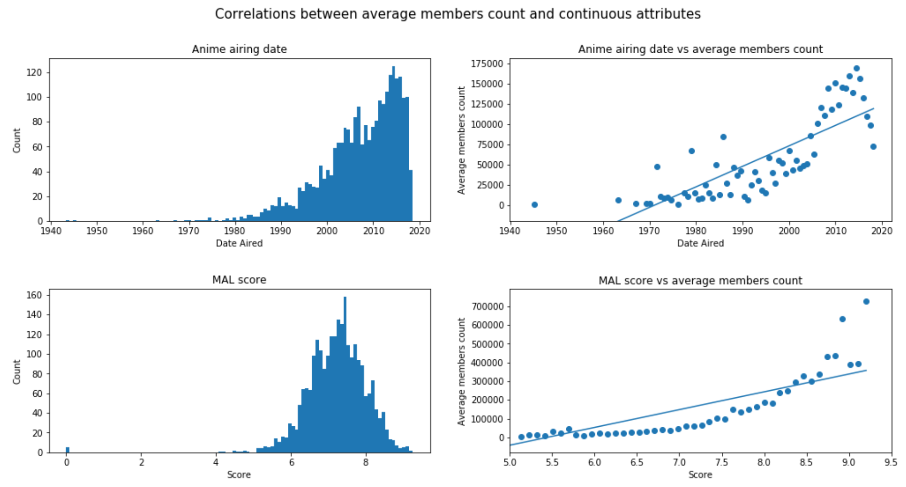
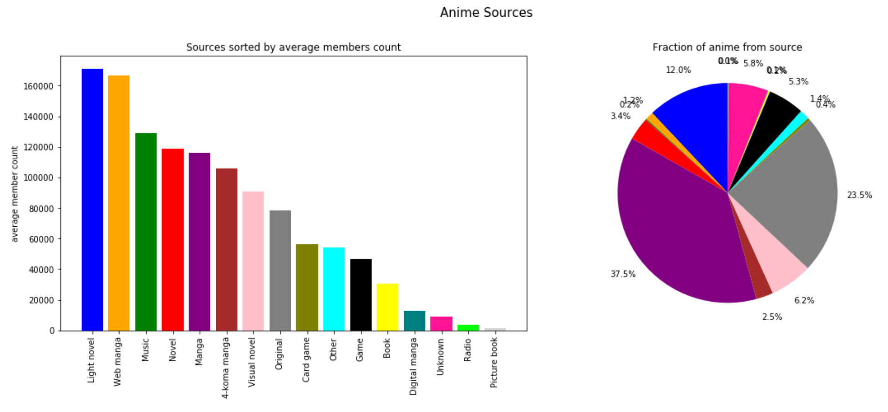
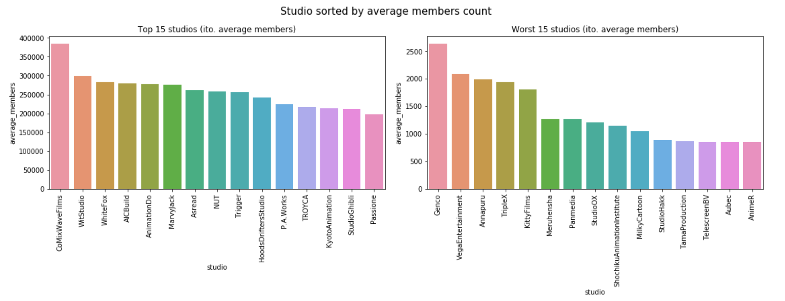
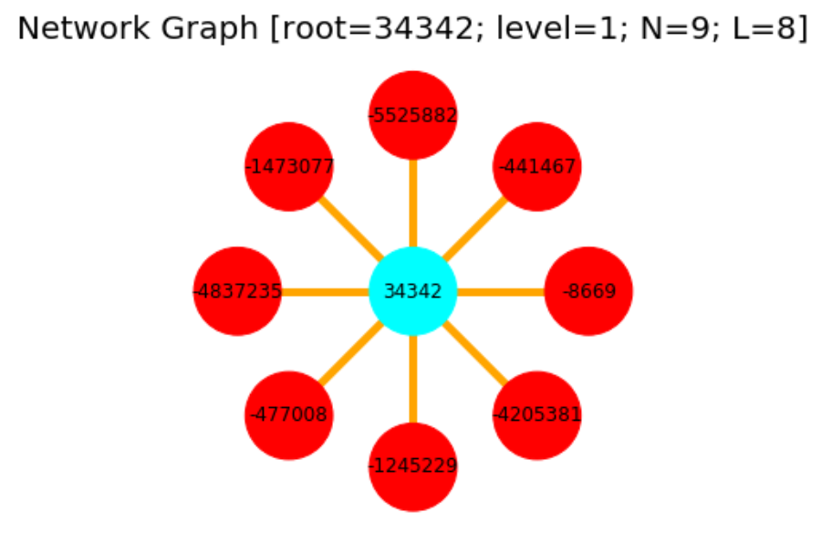

**This is a project aimed at analyzing the anime and manga social networking platform [MyAnimeList](https://myanimelist.net/) and it's users.**

[An explainer notebook can be found here](https://nbviewer.jupyter.org/github/oliv2079/ProjectB_Website/blob/gh-pages/ProjectB_Final_V3.ipynb)

If the link is broken try [here](https://nbviewer.jupyter.org/github/oliv2079/ProjectB_Website/blob/gh-pages//Explainer_Notebook/ProjectB_Final.ipynb)

Otherwise contact me on doocmail@gmail.com

# Introduction
[MyAnimeList](https://myanimelist.net/) (abbreviated as MAL) is a social networking platform where people discuss, review, and share information about anime, manga, and the like. It was launched in November 2004 by Garett Gyssler and has since gathered a vast userbase. Users can log and provide detailed information about anime they have watched or want to watch and store them in lists. This project will mainly focus on analyzing the network of users and anime these lists create. Additionally it is explored what makes an anime popular with MAL users and how positive/negative anime reviews are.

The dataset used contains information about 14.478 anime, 302.675 users and 80.076.112 userlist entries. It only has information up until July 2018. Only drama anime will be included and analyzed in the network as there was not enough computer power available to process more.

Reviews were retrieved in December 2020 via the Jikan API and contains reviews up to that point (more information in the explainer notebook).

The datasets can be downloaded from google drive [here](https://drive.google.com/file/d/14VxtPMgNMbMo2vSABc_UwTxnidj2SgSi/view?usp=sharing)

# Network Analysis

## What makes an Anime Popular

First, let's take a look at whether some of the attributes correlate with the popularity of an anime. Specifically we will look at airing date, MAL review score, sources, type, and the studio that produced it.

All 14.478 anime are analyzed in this section.

Let's first take a look at the continuous variables. We will start by looking at popularity's correlation with the airing date of anime and the MAL review scores.



The number of anime released have been rising exponentially with time as seen on the top left plot. On the top right plot it can be observed that popularity of an anime tend to rise expontially with it's airing date except for anime released in the most recent years that likely have yet to gain popularity. These two observations together seem to imply that supply of and demand for anime is increasing. MAL users tend to watch newer anime rather than older. On the bottom right plot we see that popularity also rises exponentially with the MAL score of the anime. This means that the better the anime (the better reviewed it is) the more popular it will tend to be as would be expected. Anime tend to have a review score above 7 as seen on the bottom left plot

Now let's look at some categorial data. We will first be looking at where the anime was adapted from and whether this is related to it's popularity. 



Anime adapted from light novels are the most popular on average and constitute 12% of all anime on MAL. 1.2% of all anime on MAL are adapted from web manga and they tend to be as popular as light novels. Interestingly, anime adapted from manga are that much less popular than light novels and web manga despite 37.5% of all anime being adapted from them. Much the same can be said about original anime (anime not adapted from other sources) that are even less popular than manga adaptations. The reason for them not being as popular as adaptations is because these already have an audience. If a person has read the manga, they already know it and are probably more likely to watch the anime than if they hadn't. 

Next up let's look at what type of anime it is (a series, a movie, etc.)


Anime series tend to be way more popular than movies and spinoffs. They also constitute 62.5% of all anime on the platform. Users do not seem to have that many spinoffs (OVAs, Specials) in their lists, likely because they are satisfied with having the original anime in their library or because they don't think it's worth adding a single episode to their library. 

Let's look at which studios produce the most popular anime:



The three studios whose anime are most popular on average are:

**CoMixWaverFilms** is the studio with the highest average members count. They have produced critically acclaimed anime *such as Kimi no Na wa.* and *Tenki no Ko.*

**WitStudio** has made the extremely popular *Attack on titan* and other popular anime such as *Owari no Seraph* and *Mahoutsukai no Yome*

**Whitefox** has produced very popular anime such as *Steins Gate*, *Re:Zero kara Hajimeru Isekai Seikatsu* and *Akame ga Kill!*


## Introducing the network

The network was made from the userlists dataframe. The network is made up of all anime that are in users' lists as well as all users who have one or more anime in their library. There is a link between a user and an anime if the user has the anime in one of their lists. The resulting network is bipartite since users can only be connected to anime and vice versa. As mentioned, only anime in the drama genre were included in the network. 


## Sentiment Analysis on Reviews


# Download the Datasets
The raw data (MAL users, anime and userlists datasets) used can be downloaded form [Kaggle](https://www.kaggle.com/azathoth42/myanimelist) 

The Kaggle data as well as the reviews dataset and some processed data can be downloaded from google drive [here](https://drive.google.com/file/d/14VxtPMgNMbMo2vSABc_UwTxnidj2SgSi/view?usp=sharing)

[An explainer notebook can be found here](https://nbviewer.jupyter.org/github/oliv2079/ProjectB_Website/blob/gh-pages/ProjectB_Final_V3.ipynb)

If the link is broken try [here](https://nbviewer.jupyter.org/github/oliv2079/ProjectB_Website/blob/gh-pages//Explainer_Notebook/ProjectB_Final.ipynb)


# Appendix
The main goals are to provide information about:

- User watching habits and what makes an anime popular based on different parameters (release date, score, etc.)
- How (or whether) users can be separated into meaningful groups given the tags they provide to the MAL platform
- How review sentiments differ based on different parameters (review date, score, etc.)


The data used in this analyzis is mainly based on the [Kaggle](https://www.kaggle.com/) dataset *MyAnimeList Dataset* containing information about $300k$ users, $14k$ anime and $80mil$ ratings from [MyAnimeList.net](https://myanimelist.net/).

The Kaggle dataset can be found [here](https://www.kaggle.com/azathoth42/myanimelist) (last visited 08/12/2020)

Reviews have retrieved from the unofficial MyAnimeList API: [Jikan API](https://jikan.moe/). 


TEEEEEEEEEEEEEEEST





You can use the [editor on GitHub](https://github.com/oliv2079/ProjectB_Website/edit/gh-pages/index.md) to maintain and preview the content for your website in Markdown files.

Whenever you commit to this repository, GitHub Pages will run [Jekyll](https://jekyllrb.com/) to rebuild the pages in your site, from the content in your Markdown files.

### Markdown

Markdown is a lightweight and easy-to-use syntax for styling your writing. It includes conventions for

```markdown
Syntax highlighted code block

# Header 1
## Header 2
### Header 3

- Bulleted
- List

1. Numbered
2. List

**Bold** and _Italic_ and `Code` text

[Link](url) and 


```

For more details see [GitHub Flavored Markdown](https://guides.github.com/features/mastering-markdown/).

### Jekyll Themes

Your Pages site will use the layout and styles from the Jekyll theme you have selected in your [repository settings](https://github.com/oliv2079/ProjectB_Website/settings). The name of this theme is saved in the Jekyll `_config.yml` configuration file.

### Support or Contact

Having trouble with Pages? Check out our [documentation](https://docs.github.com/categories/github-pages-basics/) or [contact support](https://github.com/contact) and we’ll help you sort it out.
