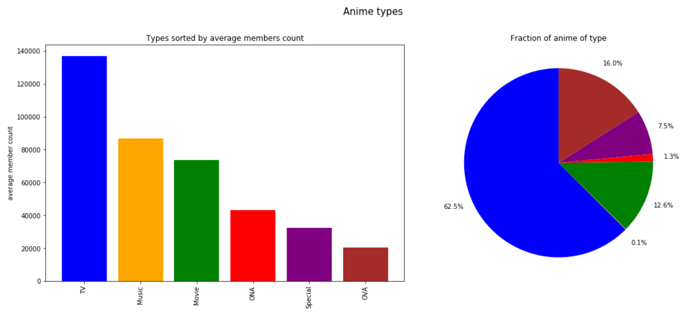

**This is a project aimed at analyzing the anime and manga social networking platform [MyAnimeList](https://myanimelist.net/) and it's users.**

An explainer notebook can be found [here](https://nbviewer.jupyter.org/github/oliv2079/ProjectB_Website/blob/gh-pages/ProjectB_Final_V3.ipynb)

If the link is broken try downloading from google drive [here](https://drive.google.com/file/d/1qQkOn8d7vcms8tDfwVESRDpMCp1QYX1v/view?usp=sharing)

Otherwise contact me on doocmail@gmail.com

# Introduction
[MyAnimeList](https://myanimelist.net/) (abbreviated as MAL) is a social networking platform where people discuss, review, and share information about anime, manga, and the like. It was launched in November 2004 by Garett Gyssler and has since gathered a vast userbase. Users can log and provide detailed information about anime they have watched or want to watch and store them in lists. This project will mainly focus on analyzing the network of users and anime these lists create. Additionally it is explored what makes an anime popular with MAL users and how positive/negative anime reviews are.

The dataset used contains information about 14.478 anime, 302.675 users and 80.076.112 userlist entries. It only has information up until July 2018. Only drama anime will be included and analyzed in the network as there was not enough computer power available to process more.

Reviews were retrieved in December 2020 via the Jikan API and contains reviews up to that point (more information in the explainer notebook).

The datasets can be downloaded from google drive [here](https://drive.google.com/file/d/14VxtPMgNMbMo2vSABc_UwTxnidj2SgSi/view?usp=sharing)

# Network Analysis

## What makes an Anime Popular

First, let's take a look at some of the data attributes and see if they correlate with the popularity of an anime. Specifically we will look at airing date, MAL review score, sources, type, and the studio that produced it.

All 14.478 anime are analyzed in this section.

Let's first take a look at the continuous variables. We will start by looking at popularity's correlation with the airing date of anime and the MAL review scores.

The number of anime released have been rising exponentially with time as seen on the top left plot. On the top right plot it can be observed that popularity of an anime tend to rise expontially with it's airing date except for anime released in the most recent years that likely have yet to gain popularity. These two observations together seem to imply that supply of and demand for anime is increasing. MAL users tend to watch newer anime rather than older. On the bottom right plot we see that popularity also rises exponentially with the MAL score of the anime. This means that the better the anime (the better reviewed it is) the more popular it will tend to be as would be expected. Anime tend to have a review score above 7 as seen on the bottom left plot

Now let's look at some categorial data. We will first be looking at where the anime was adapted from and whether this is related to it's popularity. 

Anime adapted from light novels are the most popular on average and constitute 12% of all anime on MAL. 1.2% of all anime on MAL are adapted from web manga and they tend to be as popular as light novels. Interestingly, anime adapted from manga are that much less popular than light novels and web manga despite 37.5% of all anime being adapted from them. Much the same can be said about original anime (anime not adapted from other sources) that are even less popular than manga adaptations. The reason for them not being as popular as adaptations is because these already have an audience. If a person has read the manga, they already know it and are probably more likely to watch the anime than if they hadn't. 

Next up let's look at what type of anime it is (a series, a movie, etc.)

Anime series tend to be way more popular than movies and spinoffs. They also constitute 62.5% of all anime on the platform. Users do not seem to have that many spinoffs (OVAs, Specials) in their lists, likely because they are satisfied with having the original anime in their library or because they don't think it's worth adding a single episode to their library. 

Let's look at which studios produce the most popular anime:

The three studios whose anime are most popular on average are:

**CoMixWaverFilms** is the studio with the highest average members count. They have produced critically acclaimed anime *such as Kimi no Na wa.* and *Tenki no Ko.*

**WitStudio** has made the extremely popular *Attack on titan* and other popular anime such as *Owari no Seraph* and *Mahoutsukai no Yome*

**Whitefox** has produced very popular anime such as *Steins Gate*, *Re:Zero kara Hajimeru Isekai Seikatsu* and *Akame ga Kill!*

## Introducing the network

The network was made from the userlists dataframe. The network is made up of all anime that are in users' lists as well as all users who have one or more anime in their library. There is a link between a user and an anime if the user has the anime in one of their lists. The resulting network is bipartite since users can only be connected to anime and vice versa. As mentioned, only anime in the drama genre were included in the network.

Plotting the whole network would be somewhat pointless with that many links. Let's choose a root and find their level 1 and level 2 neighbors to getter picture of how the network is structured:

The root here is the anime *Maki to Kanta to Jiijii to.* (ID: 34342). It has the lowest degree (8) out of all the anime nodes in the network. Using an anime with very low degree made it easier to visualize. Observe that no user (red nodes) is connected to other users and that the anime only has users as neighbors. Let's now take at look at level 2 neighbors:

All but 2 anime are in this sub-network. This is because a few users have almost all anime in their libraries. This makes it pointless to try to project the bipartite network onto the anime nodes as this would result in an almost complete network. This will be discussed in the community detection section.

Now that we know what the network looks like let's move on to some statistics.

### Network Statistics

- Nodes: 277.833
- Anime Nodes : 2.294
- User Nodes: 275.539
- Links: 22.358.833
- Components: 1
- k_min: 1
- k_max: 165233
- k_median: 58.0
- k_mean: 160.9516
- p: 0.000579

Below is the degree distribution for anime nodes:

### Anime Degree Distribution

**x-axis = degrees and y-axis = counts**

Most anime have a very low degree (are in many peoples' lists). The distribution follows a power law!

1486 out of 2294 (over half of) anime are only in 8 to 4964 users' lists. Quite a low number considering there are 275.539 users in the network.

### User Degree Distribution

**x-axis = degrees and y-axis = counts**

This distribution also follows a power law. 158511 out of 275539 (over half of) users have under 69 anime in their lists.

## Community detection

It is tested whether users can be separated into meaningful groups by partitioning them into communities. The users' use of tags will determine this. 

Problems occured when trying to find communities. The size of the graph was too big to project. There are given new conditions for there to be a link between an anime and a user. The current network has 22.358.833 links. This needs to be sized down to a few hundred thousand. Because of time constraints it was not possible to redo the whole network statistics and visualization section. The new constaints are:

1. The anime must be a Drama
2. The user must have added a tag to the anime
3. One of the tags added to the anime should be at least 3 letters long
4. There should be at least 10 of those tags in the network.
5. The user must be female

This results in 129.181 links and the graph can now be projected. 

The idea is then to find out whether communities give anime different kinds of tags. This is done by counting unique words in each community and calculating TF-IDF weights.

The numerical statistic TF-IDF is a measure of how important a word is. This can be used to prioritise words used frequently in one community and not a lot in others.

The giant (biggest component) of the graph is extracted from the graph to make sure that small components do not mess with the results when calculating TF-IDF weights for tags.

The resulting giant has the following traits:

- Nodes: 9757
- Anime Nodes : 1587
- User Nodes: 8170  
- Links: 129179
- Components: 1
- k_min: 1
- k_max: 1203
- k_median: 7.0
- k_mean: 26.48
- p: 0.002714

The graph is projected onto the user nodes to create a unipartite graph of users. There is a connection between two users if they have tagged the same anime and if the above restrictions are held.

The resulting unipartite graph is then partitioned into communities using the Louvain algorithm that finds the best partition of a network using a greedy optimization method. 

TF-IDFs are calculated and the following wordsclouds were plotted for each community:

5 communities were found. The number of users in each community can be seen on the respective wordclouds. A lot of words that are not in english. These appear very frequently in specific communities. For example Community 0 and 3 is mostly english while community 2 seems to have a lot of Spanish and or Portuguese words. It's interesting to see that the community detection to some extent has separated users with different nationalities into separate communities! There also seems to be a difference in what category of anime are tagged. For example in community 0 where shounenai (love between boys) and bishounen (beautiful boy) are frequent tags while community 3 seems to tag the anime Code Geass: lelouch of the rebellion a lot. Community 1 seems to be more wholesome than community 0 with frequent tags such as families, kimono and angellike.

## Sentiment Analysis on Reviews

Sentiments are measures of happiness/negativeness. This section focuses on finding sentiments for the top 20 reviews for all anime on MAL and testing how sentiments correlate with different attributes from both the review dataset and the anime dataset. 

Sentiments scores are calculated using the LabMT wordlist consisting of 10.000 words where each word's happiness/negativeness has been evaluated.

Sentiment scores for every word in a review are averaged and added to the review dataframe.

The average sentiments are plotted against different attributes. 

The top left plot shows how many reviews have been written over time. The top right plot shows the relationship between when the review was written and the average sentiment. It is observed that review sentiments are generally becoming less happy over time. 

The bottom left plot shows the number of reviews on anime aired on a specific date. Note that this is not the number of anime aired, it is the number of reviews (up to 20 per anime) accumulated for every anime that was aired at that point in time.

Looking at the bottom right plot, sentiments do not seem to change significantly depending on when the anime was released. There is a large sentiment variation before 2000 but this is likely due to scarcity of reviews.

Next is the relationship between review scores and average sentiment

There is a clear relationship between review score and review sentiment (as was to be expected). The average sentiment difference between a review score of 1 and a review score of 10 is ~0.3, which is not much but the connection is quite clear.

As with the review scores, there is a clear relationship between MAL score and the average sentiment. Anime that are generally disliked are more likely to have more negatively written reviews.

Here is the happiest and the saddest review on the MAL platform:

The happiest review was made by **HazelOwers**, August 2012 about the anime movie **Pokemon Movie 02: Maboroshi no Pokemon Lugia Bakutan**:

*"This is my favourite pokemon movie :) i love lugia's song, beautiful music"* **(sentiment score: 7.29)**

The saddest review on the MAL platform was made by **aeris2001x2** August 2010 about the anime **Soujuu Senshi Psychic Wars**:

*This is without doubt the WORST anime i have ever seen. Please never watch this, it will suck your soul away :( * **(sentiment score: 4.20)**

# Download the Datasets
The raw data (MAL users, anime and userlists datasets) used can be downloaded form [Kaggle](https://www.kaggle.com/azathoth42/myanimelist) 

The Kaggle data as well as the reviews dataset and some processed data can be downloaded from google drive [here](https://drive.google.com/file/d/14VxtPMgNMbMo2vSABc_UwTxnidj2SgSi/view?usp=sharing)

[An explainer notebook can be found here](https://nbviewer.jupyter.org/github/oliv2079/ProjectB_Website/blob/gh-pages/ProjectB_Final_V3.ipynb)

If the link is broken try [here](https://nbviewer.jupyter.org/github/oliv2079/ProjectB_Website/blob/gh-pages//Explainer_Notebook/ProjectB_Final.ipynb)

